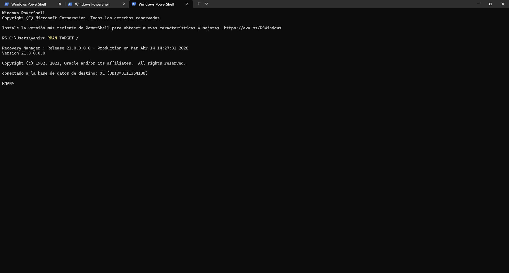
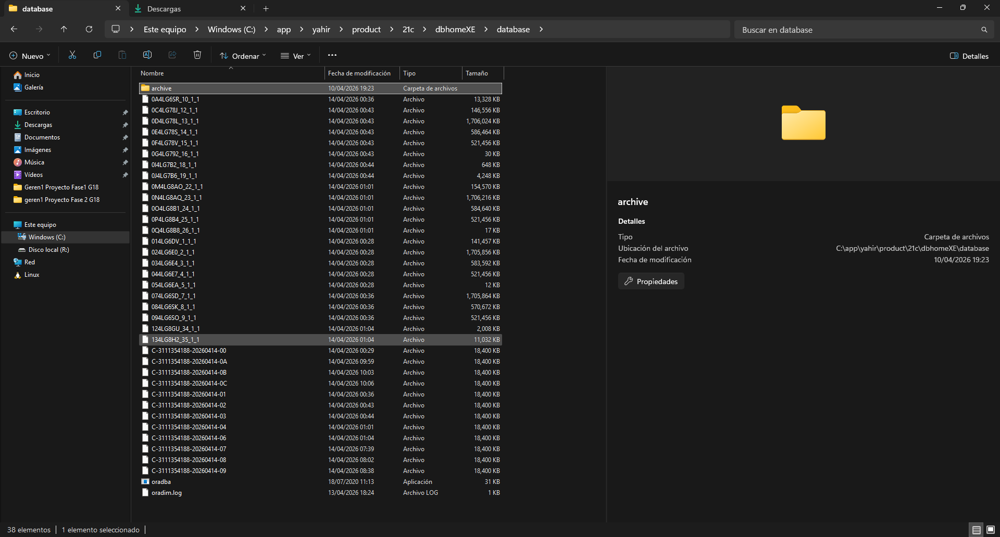
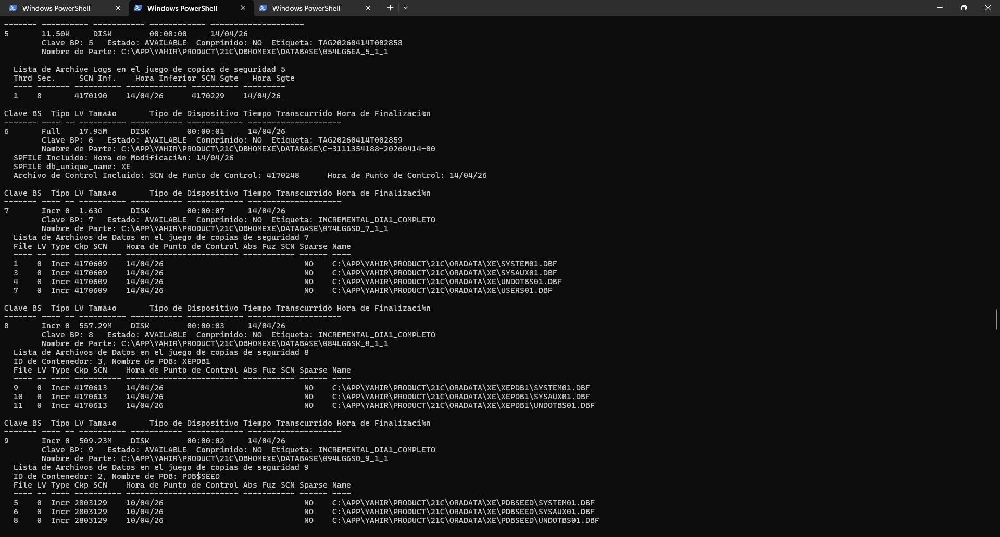

# Manual de Usuario: Respaldo y Restauración de Base de Datos
## Procedimientos para Backup y Recovery en Oracle Database 21c

---

## Tabla de Contenidos
1. [Introducción](#1-introducción)
2. [Requisitos del Sistema](#2-requisitos-del-sistema)
3. [Conceptos Básicos](#3-conceptos-básicos)
4. [Procedimiento de Full Backup](#4-procedimiento-de-full-backup)
5. [Procedimiento de Backup Incremental](#5-procedimiento-de-backup-incremental)
6. [Validación de Backups](#6-validación-de-backups)
7. [Procedimiento de Restauración](#7-procedimiento-de-restauración)
8. [Solución de Problemas](#8-solución-de-problemas)
9. [Contacto y Soporte](#9-contacto-y-soporte)

---

## 1. Introducción

Este manual proporciona instrucciones paso a paso para ejecutar respaldos (backups) y restauraciones de la base de datos **PROYECTO2BASES2** en Oracle Database 21c.

Existen dos tipos de respaldos que puede ejecutar:
- **Full Backup:** Copia completa de toda la base de datos
- **Incremental Backup:** Copia solo de los cambios desde el último backup

**Importante:** Realice backups regularmente para proteger sus datos contra pérdida accidental.

---

## 2. Requisitos del Sistema

### Herramientas Necesarias
- **Oracle Database 21c Express Edition** (versión 21.3.0.0.0)
- **RMAN (Recovery Manager)** - incluido con Oracle
- **SQL Developer** o **SQL*Plus** para consultas
- Acceso de administrador a la base de datos

### Acceso Requerido
- Usuario con rol **SYSDBA**
- Permisos de escritura en carpeta `C:\BACKUPS\PROYECTO2\`
- Espacio en disco disponible:
  - **Full Backup:** Mínimo 600 MB
  - **Backup Incremental:** Mínimo 50 MB

### Parámetros de Conexión
| Parámetro | Valor |
| :--- | :--- |
| **Host** | localhost |
| **Puerto** | 1521 |
| **Base de Datos** | XEPDB1 |
| **Usuario Recomendado** | sys o system |

---

## 3. Conceptos Básicos

### Full Backup (Nivel 0)
Un **Full Backup** realiza una copia completa de todos los datos de la base de datos. Es la base para cualquier estrategia de backup.

**Cuándo usar:**
- Diariamente para bases pequeñas
- Una vez por semana para bases grandes
- Después de cambios estructurales importantes

### Incremental Backup (Nivel 1)
Un **Incremental Backup** solo guarda los bloques que fueron modificados desde el último Full Backup.

**Ventajas:**
- Usa 60-70% menos espacio en disco
- Se ejecuta más rápido
- Ideal para bases de datos activas

**Cuándo usar:**
- De martes a viernes (si ejecutó Full el lunes)
- Diariamente en bases muy activas
- Cuando el espacio es limitado

### Archive Logs
Los **Archive Logs** registran todos los cambios en la base de datos. Son necesarios para:
- Restauraciones punto en tiempo
- Recuperación ante desastres
- Auditoría de cambios

---

## 4. Procedimiento de Full Backup

### Paso 1: Abrir RMAN

Abra una línea de comandos (CMD o PowerShell) y ejecute:

```bash
RMAN TARGET /
```

Debería ver:

```
Recovery Manager: Release 21.0.0.0.0 - Production on [fecha]
Connected to target database: XEPDB1 (DBID=...)
```



*Imagen 1: Consola RMAN correctamente conectada a la base de datos*

### Paso 2: Ejecutar el Full Backup

Copie y pegue el siguiente comando en RMAN:

```sql
RUN {
   ALLOCATE CHANNEL c1 DEVICE TYPE DISK;
   BACKUP PLUGGABLE DATABASE XEPDB1 
   FORMAT 'C:\BACKUPS\PROYECTO2\FULL_%U.bkp' 
   TAG 'BACKUP_FULL_DIA_X';
   RELEASE CHANNEL c1;
}
```

**Reemplace `DIA_X` con la fecha o número de día:**
- Ejemplo: `BACKUP_FULL_DIA_1` o `BACKUP_FULL_20260414`

### Paso 3: Monitorear la Ejecución

El backup mostrará:
```
Starting backup at 14-APR-26
Allocated 1 channel: c1
channel c1: SID=... devtype=DISK
...
Finished backup at 14-APR-26
```

](<../evidencias/backu FULL_DIa2.png>)

*Imagen 2: Ejecución del Full Backup en RMAN*

**Tiempo esperado:** 1-3 segundos para bases pequeñas

### Paso 4: Verificar Éxito

Al finalizar debería ver:

```
BACKUP COMPLETE
```


*Imagen 3: Mensaje de éxito del Full Backup*

Si aparece un error, vea la sección [Solución de Problemas](#8-solución-de-problemas).

---

## 5. Procedimiento de Backup Incremental

### Requisito Previo
Debe haber ejecutado un **Full Backup** antes. Los backups incrementales dependen de este.

### Paso 1: Abrir RMAN

```bash
RMAN TARGET /
```

### Paso 2: Ejecutar Incremental Backup Nivel 1

```sql
RUN {
   ALLOCATE CHANNEL c1 DEVICE TYPE DISK;
   BACKUP INCREMENTAL LEVEL 1 PLUGGABLE DATABASE XEPDB1 
   FORMAT 'C:\BACKUPS\PROYECTO2\INCR_%U.bkp' 
   TAG 'INCREMENTAL_DIA_X';
   RELEASE CHANNEL c1;
}
```

**Reemplace `DIA_X` con la fecha o número:**
- Ejemplo: `INCREMENTAL_DIA_2` o `INCREMENTAL_20260414`

### Paso 3: Monitorear la Ejecución

Espere hasta ver:

```
BACKUP COMPLETE
```

**Tiempo esperado:** <1 segundo (más rápido que Full)

### Paso 4: Registrar Información

Tome nota del **Piece** (ID único del backup) que aparece en pantalla:
```
Piece Handle=C:\BACKUPS\PROYECTO2\INCR_0J4LG7B6_1_1.bkp 
...
```

](<../evidencias/fase 4/backupincremental3.png>)

*Imagen 6: Información del Backup Incremental Nivel 1*

Esta información es importante para restaurar.

---

## 6. Validación de Backups

### Método 1: Verificar Archivos Creados

Abra el explorador de archivos y vaya a:

```
C:\BACKUPS\PROYECTO2\
```

Debería ver archivos con extensión `.bkp`:
- `FULL_0J4LG7B6_1_1.bkp` (Full Backup)
- `INCR_0J4LG7B6_2_1.bkp` (Incremental)



*Imagen 4: Archivos .bkp en el directorio de backups*

### Método 2: Validar Contenido del Backup

En RMAN, ejecute:

```sql
LIST BACKUP;
```

Esto mostrará todos los backups disponibles:

```
List of Backups
Key     TY LV S Dev Type Status    Piece Name
------- -- -- - -------- --------- ----------
1       B  F  A DISK     AVAILABLE FULL_0J4...
2       B  1  A DISK     AVAILABLE INCR_0J4...
```



*Imagen 5: Comando LIST BACKUP mostrando backups disponibles*

### Método 3: Contar Registros en la Base de Datos

Antes del backup, cuente los registros:

```sql
SELECT COUNT(*) FROM PROYECTO2BASES2.PARTIDO;
SELECT COUNT(*) FROM PROYECTO2BASES2.GOL;
SELECT COUNT(*) FROM PROYECTO2BASES2.JUGADOR_PAIS;
```

Anote estos números para comparar después de restaurar.

---

## 7. Procedimiento de Restauración

### Advertencia Importante
La restauración **sobrescribe la base de datos actual**. Solo proceda si tiene un backup actualizado o no necesita los datos actuales.

### Escenario 1: Restaurar Último Full Backup

Ejecute en RMAN:

```sql
RUN {
   SHUTDOWN IMMEDIATE;
   STARTUP MOUNT PLUGGABLE DATABASE XEPDB1;
   RESTORE PLUGGABLE DATABASE XEPDB1;
   RECOVER PLUGGABLE DATABASE XEPDB1;
   ALTER PLUGGABLE DATABASE XEPDB1 OPEN RESETLOGS;
}
```

**Tiempo esperado:** 4-5 segundos (incluye cierre y reapertura de BD)

### Escenario 2: Restaurar a Punto Específico en Tiempo

Si necesita restaurar la base de datos a una fecha/hora específica:

```sql
RUN {
   SET UNTIL TIME "to_date('2026-04-14 01:05:00', 'YYYY-MM-DD HH24:MI:SS')";
   
   SHUTDOWN IMMEDIATE;
   STARTUP MOUNT PLUGGABLE DATABASE XEPDB1;
   RESTORE PLUGGABLE DATABASE XEPDB1;
   RECOVER PLUGGABLE DATABASE XEPDB1;
   ALTER PLUGGABLE DATABASE XEPDB1 OPEN RESETLOGS;
}
```

Reemplace la fecha y hora según sea necesario.

### Paso a Paso

1. **Abra RMAN:**
   ```bash
   RMAN TARGET /
   ```

2. **Cierre la base de datos:**
   ```sql
   SHUTDOWN IMMEDIATE;
   ```

3. **Inicie en modo MOUNT:**
   ```sql
   STARTUP MOUNT PLUGGABLE DATABASE XEPDB1;
   ```

4. **Restaure los datos:**
   ```sql
   RESTORE PLUGGABLE DATABASE XEPDB1;
   ```

5. **Recupere los cambios desde logs:**
   ```sql
   RECOVER PLUGGABLE DATABASE XEPDB1;
   ```

6. **Abra la base de datos:**
   ```sql
   ALTER PLUGGABLE DATABASE XEPDB1 OPEN RESETLOGS;
   ```

### Validar Restauración Exitosa

Después de abrir la base de datos, verifique:

```sql
SELECT COUNT(*) FROM PROYECTO2BASES2.PARTIDO;
SELECT COUNT(*) FROM PROYECTO2BASES2.GOL;
```

](<../evidencias/fase 3/countdia3 truncate.png>)

*Imagen 7: Verificación de registros después de restauración*

Los números deben ser igual a los registrados **antes** del backup.

---

## 8. Solución de Problemas

### Problema 1: "RMAN-00571: Error Allocating Channel"

**Causa:** Directorio de backup no existe o sin permisos.

**Solución:**
1. Verifique que `C:\BACKUPS\PROYECTO2\` exista
2. Cree las carpetas si no existen:
   ```bash
   mkdir C:\BACKUPS\PROYECTO2
   ```
3. Reinicie RMAN

### Problema 2: "ORA-00257: Archiver Error"

**Causa:** Espacio en disco insuficiente o archive logs llenos.

**Solución:**
1. Libere espacio en disco (elimine archivos innecesarios)
2. Verifique espacio disponible:
   ```bash
   dir C:\BACKUPS\
   ```

### Problema 3: "ORA-01033: Initialization or Recovery in Progress"

**Causa:** La base de datos está en proceso de recuperación.

**Solución:**
1. Espere 30 segundos
2. Intente reconectar:
   ```bash
   RMAN TARGET /
   ```

### Problema 4: "Cannot Allocate Backup Channel"

**Causa:** RMAN no está correctamente conectado.

**Solución Completa:**
```bash
# 1. Salga de RMAN
EXIT;

# 2. Abra CMD como Administrador
# 3. Vuelva a iniciar RMAN
RMAN TARGET /

# 4. Si falla, reinicie el servicio Oracle
net stop OracleServiceXEPDB1
net start OracleServiceXEPDB1
```

### Problema 5: "Insufficient Space for Backup"

**Causa:** No hay espacio suficiente en disco.

**Solución:**
1. Verifique espacio disponible:
   ```bash
   dir C:\ | grep BACKUPS
   ```
2. Elimine backups antiguos si es seguro
3. Considere usar disco externo o red

---

## 9. Contacto y Soporte

### Para Reportar Problemas
| Aspecto | Contacto |
| :--- | :--- |
| **Problemas Técnicos** | DBA Oracle - Extensión 1234 |
| **Acceso a Directorios** | Administrador de Sistemas - Ext. 5678 |
| **Capacitación** | Centro de Soporte TI |
| **Documentación** | [Ver Documentación Técnica](DocumentacionTecnica.md) |

### Información de Emergencia
En caso de **pérdida de datos crítica:**
1. **NO apague la base de datos**
2. **Contacte inmediatamente al DBA Oracle**
3. Tenga listo el último backup disponible
4. Anote la hora exacta del incidente

### Recursos Adicionales
- **Manual Técnico:** [DocumentacionTecnica.md](DocumentacionTecnica.md)
- **Comandos RMAN Comunes:** Ver Sección 9.1 del Manual Técnico
- **Tablas de Datos:** Consulte [Estructura de BD](DocumentacionTecnica.md#4-estructura-de-la-base-de-datos)
