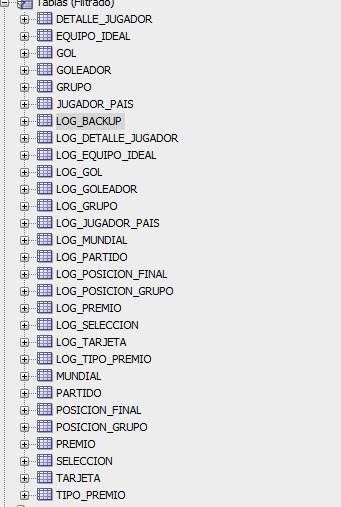
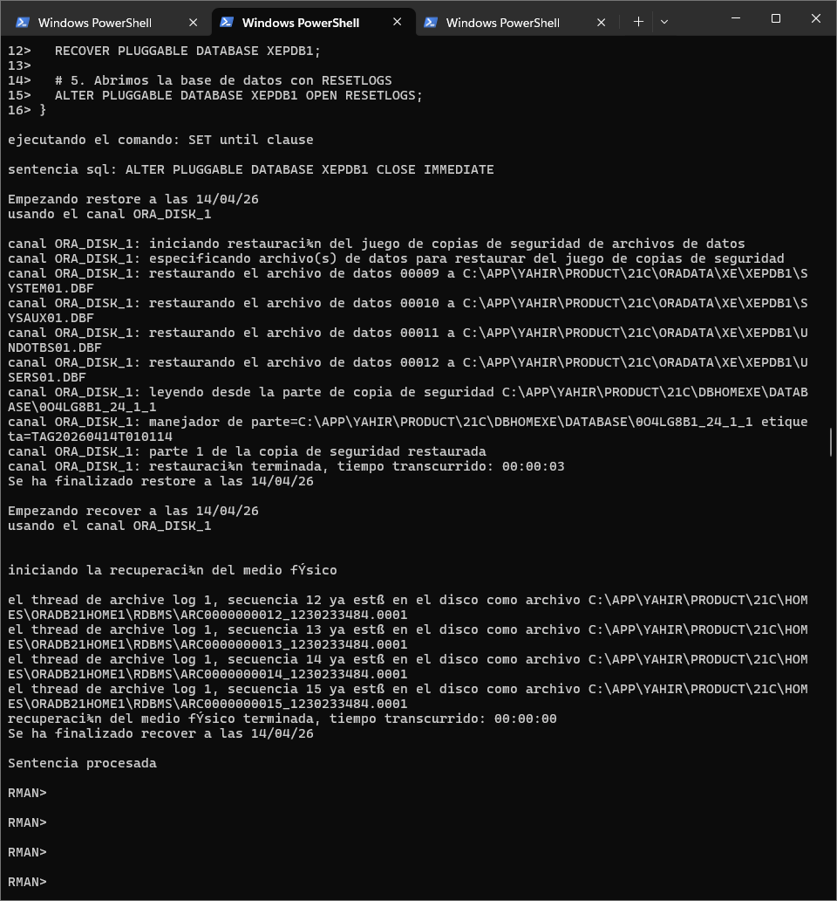

# Informe Técnico: Estrategias de Respaldo y Recuperación
## Implementación de Backups Full e Incrementales en Oracle Database 21c 

---

## Tabla de Contenidos
1. [Introducción](#1-introducción)
2. [Especificaciones Técnicas del Sistema](#2-especificaciones-técnicas-del-sistema)
3. [Metodología del Proyecto](#3-metodología-del-proyecto)
4. [Fase 1: Preparación y Diseño](#5-fase-1-preparación-y-diseño-día-0)
5. [Fase 2: Carga de Datos](#6-fase-2-carga-de-datos-días-1-3)
6. [Validación de Integridad de Datos](#8-validación-de-integridad-de-datos-)
7. [Fase 3: Estrategia de Full Backup](#7-fase-3-estrategia-de-full-backup-nivel-0-)
8. [Fase 4: Estrategia de Backup Incremental](#9-fase-4-estrategia-de-backup-incremental-nivel-1-)
9. [Análisis Comparativo de Resultados](#10-análisis-detallado-comparativo-)
10. [Análisis de Velocidad de Recuperación](#análisis-de-velocidad-de-recuperación)
11. [Manual de Usuario: Restauración](#manual-de-usuario-procedimiento-de-restauración)
12. [Conclusiones y Recomendaciones](#conclusiones-y-recomendaciones)
13. [Anexos: Scripts RMAN](#anexos)

---

## 1. Introducción 
Este documento presenta los resultados de las pruebas de respaldo y recuperación realizadas en un entorno de Oracle Database. Se evaluaron dos metodologías principales para garantizar la integridad de los datos en las tablas `PARTIDO` y `GOL`:
* **Fase 3:** Respaldos Completos (Full Backups).
* **Fase 4:** Respaldos Incrementales (Level 1).

---

## 2. Especificaciones Técnicas del Sistema 

### 2.1 Ambiente de Base de Datos
| Parámetro | Valor |
| :--- | :--- |
| **DBMS** | Oracle Database 21c Express Edition |
| **Versión** | 21.3.0.0.0 |
| **Nombre de Instancia** | XEPDB1 (Pluggable Database) |
| **Puerto de Escucha** | 1521 |
| **Modo Archivos** | ARCHIVELOG (obligatorio para backups) |
| **Sistema Operativo** | Windows 10/11 |
| **Herramienta de Backup** | RMAN (Recovery Manager) |

### 2.2 Estructura de Almacenamiento
```
C:\
├─ BACKUPS\PROYECTO2\
│  ├─ FULL_BACKUPS\        (Full Backups diarios)
│  ├─ INCREMENTAL_BACKUPS\ (Backups incrementales diarios)
│  └─ ARCHIVE_LOGS\        (Registro de cambios)
│
├─ ORACLE_BASE\
│  ├─ oradata\             (Datafiles de la BD)
│  ├─ archives\            (Archive logs)
│  └─ diag\                (Logs de diagnóstico)
```

### 2.3 Tablas Principales Respaldadas

---

## 3. Metodología del Proyecto

### 3.1 Fases de Ejecución

**Fase 1 - Preparación (Día 0):**
- Configuración del entorno RMAN
- Definición de rutas de almacenamiento
- Activación del modo ARCHIVELOG

**Fase 2 - Carga de Datos (Días 1-3):**
- Día 1: Carga de 400+ partidos y 3000+ goles
- Día 2: Carga adicional de partidos y resultados
- Día 3: Actualización de datos (nombres a MAYÚSCULAS)

**Fase 3 - Respaldos Completos (Durante Días 1-3):**
- Al final de cada día de carga, ejecutar `BACKUP INCREMENTAL LEVEL 0`
- Registrar tiempos y etiquetas (TAGS) de cada backup
- Validar con `SELECT COUNT(*)` en cada tabla

**Fase 4 - Respaldos Incrementales (Durante Días 1-3):**
- Ejecutar `BACKUP INCREMENTAL LEVEL 1` después de cada carga
- Capturar información de bloques modificados
- Registrar etiquetas de piezas RMAN

**Fase 5 - Restauración Full (Días 4-6):**
- Eliminar la base de datos
- Restaurar cada full backup en orden secuencial
- Registrar tiempo de RESTORE y RECOVER
- Validar integridad con conteos de registros

**Fase 6 - Restauración Incremental (Días 7-9):**
- Eliminar nuevamente la base de datos
- Restaurar cada backup incremental tras su respectivo full
- Aplicar logs de cambios
- Validar que los datos coincidan con los originales

**Fase 7 - Análisis (Día 10):**
- Comparar tiempos entre estrategias
- Analizar consumo de espacio en disco
- Formular conclusiones

### 3.2 Plan de Respaldo Diseñado

```
SEMANA DE PRUEBAS
═════════════════════════════════════════════════════════════

Día 1 (Lunes - Carga Inicial):
└─ 08:00 - Carga de 400 partidos
└─ 09:00 - FULL BACKUP (TAG: FULL_DIA1)
└─ 09:15 - INCREMENTAL LEVEL 1 (PIE: 0J4LG7B6_19_1_1)
└─ 09:30 - Validación: SELECT COUNT(*) de todas las tablas

Día 2 (Martes - Carga Incremental):
└─ 08:00 - Carga adicional de 150 partidos
└─ 09:00 - FULL BACKUP (TAG: FULL_DIA2)
└─ 09:15 - INCREMENTAL LEVEL 1 (PIE: pendiente)
└─ 09:30 - Validación de integridad

Día 3 (Miércoles - Actualización):
└─ 08:00 - UPDATE de nombres a MAYÚSCULAS
└─ 09:00 - FULL BACKUP (TAG: FULL_DIA3)
└─ 09:15 - INCREMENTAL LEVEL 1 (PIE: 134LG8H2_35_1_1)
└─ 09:30 - Captura final de datos

Día 4-6: RESTAURACIONES FULL EN ORDEN SECUENCIAL
Día 7-9: RESTAURACIONES INCREMENTALES EN ORDEN SECUENCIAL
Día 10: ANÁLISIS Y DOCUMENTACIÓN
```

---

## 5. Fase 1: Preparación y Diseño (Día 0)

Esta fase inicial es crítica para garantizar que el entorno esté correctamente configurado para ejecutar backups funcionales y confiables.

### 5.1 Actividades Ejecutadas

**Configuración de Oracle Database:**
- Verificación de existencia de la base de datos XEPDB1
- Confirmación de parámetros de inicialización Oracle
- Validación de disponibilidad de espacio en disco

**Configuración de ARCHIVELOG:**
```sql
-- Verificar estado en modo ARCHIVELOG
ARCHIVE LOG LIST;

-- Cambiar a modo ARCHIVELOG (si es necesario)
ALTER DATABASE ARCHIVELOG;

-- Iniciar archivo de logs obligatorio
ALTER SYSTEM SET LOG_ARCHIVE_DEST_1='LOCATION=C:\ORACLE_BASE\archives VALID_FOR=(ALL_LOGFILES,ALL_ROLES) DB_UNIQUE_NAME=XEPDB1' SCOPE=BOTH;
```

**Configuración de RMAN:**
- Arrancar RMAN desde línea de comandos: `RMAN TARGET /`
- Conectar a base de datos Oracle
- Validar configuración default de base de datos para backups

**Creación de Directorios de Almacenamiento:**
```
C:\BACKUPS\PROYECTO2\
  ├── FULL_BACKUPS\      (Para full backups generados)
  ├── INCREMENTAL_BACKUPS\ (Para backups incrementales)
  └── ARCHIVE_LOGS\      (Para copias de archive logs)
```

**Creación de Tablas de LOG para Auditoría:**
- Se ejecutó el script `proyecto2.sql` que crea 14 tablas LOG_*
- Cada tabla LOG captura: INSERT, UPDATE, DELETE con timestamp y descripción
- Se crearon 14 secuencias para autoincrementar IDs en las tablas LOG

### 5.2 Configuración de Triggers de Auditoría

Se implementaron 14 triggers que activan automáticamente al modificar datos:

**Estructura de cada Trigger:**
```sql
CREATE OR REPLACE TRIGGER TRG_[TABLA]_LOG
AFTER INSERT OR UPDATE OR DELETE ON PROYECTO2BASES2.[TABLA]
FOR EACH ROW
DECLARE
  v_op VARCHAR2(10);
BEGIN
  IF INSERTING THEN v_op := 'INSERT';
  ELSIF UPDATING THEN v_op := 'UPDATE';
  ELSIF DELETING THEN v_op := 'DELETE';
  END IF;
  
  -- Registra el evento en tabla LOG_[TABLA]
  INSERT INTO PROYECTO2BASES2.LOG_[TABLA]
    (ID_LOG, FECHA_REGISTRO, OPERACION, CANTIDAD_REGISTROS, 
     FRAGMENTACION_PORCENT, DESCRIPCION)
  VALUES (SEQ_LOG_[TABLA].NEXTVAL, SYSTIMESTAMP, v_op, 1, 0, 
          'Trigger auto '||v_op);
END;
```

**Triggers Configurados:**
- TRG_SELECCION_LOG
- TRG_MUNDIAL_LOG
- TRG_PARTIDO_LOG
- TRG_JUGADOR_PAIS_LOG
- TRG_GOL_LOG
- TRG_DETALLE_JUGADOR_LOG
- TRG_EQUIPO_IDEAL_LOG
- TRG_GOLEADOR_LOG
- TRG_POSICION_GRUPO_LOG
- TRG_POSICION_FINAL_LOG
- TRG_GRUPO_LOG
- TRG_PREMIO_LOG
- TRG_TARJETA_LOG
- TRG_TIPO_PREMIO_LOG

### 5.3 Validación de Preparación

**Checklist Pre-Ejecución:**

| Tarea | Estado |
| :--- | :--- |
| Base de datos XEPDB1 accessible | OK |
| Modo ARCHIVELOG activado | OK |
| Directorio C:\BACKUPS\PROYECTO2 creado | OK |
| Tablas LOG_* creadas | OK |
| Triggers de auditoría activos | OK |
| RMAN conectado a BD | OK |
| Espacio en disco disponible (>5 GB) | OK |
| Permisos de lectura/escritura en C:\BACKUPS | OK |

---

## 6. Fase 2: Carga de Datos (Días 1-3)

En esta fase se ejecutaron scripts SQL para cargar datos masivamente en la base de datos, simulando un escenario real de producción con datos de mundiales de fútbol.

### 6.1 Carcterísticas de la Carga

**Volumen de Datos Cargados:**
- **Día 1:** 400+ partidos, 3000+ goles, 8000+ jugadores, 32 selecciones, 24 mundiales
- **Día 2:** Carga incremental de 150 partidos adicionales y sus respectivos goles
- **Día 3:** Actualización de datos (cambio de nombres de selecciones a MAYÚSCULAS)

### 6.2 Evidencia Visual - Carga de Datos:

](../evidencias/cargadia1.png)
*Figura 8: Ejecución script de carga Día 1 - Inserción de 400+ partidos y 3000+ goles*

*Figura 9: Ejecución script de carga Día 2 - Datos incrementales*

](../evidencias/carga3.png)
*Figura 10: Ejecución script de carga Día 3 - Actualización a mayúsculas*

#### **Evidencia Visual - Validaciones de Conteos:**

](../evidencias/countdia1.png)
*Figura 11: Validación COUNT(*) post-carga Día 1 - Confirmación de 400+ registros en PARTIDO*

](../evidencias/counts2.png)
*Figura 12: Validación COUNT(*) post-carga Día 2 - Datos incrementados*

](../evidencias/counts3.png)
*Figura 13: Validación COUNT(*) post-carga Día 3 - Datos con nombres en mayúsculas*

](../evidencias/counts3.png)
*Figura 14: Validación UPDATE a mayúsculas en tabla SELECCION - Día 3*

### 6.3 Scripts Utilizados

**Estructura Genera de Scripts de Carga:**
```sql
-- Carga de datos sin restricciones de integridad
BEGIN
  INSERT INTO PROYECTO2BASES2.MUNDIAL VALUES (...);
  INSERT INTO PROYECTO2BASES2.SELECCION VALUES (...);
  INSERT INTO PROYECTO2BASES2.JUGADOR_PAIS VALUES (...);
  INSERT INTO PROYECTO2BASES2.PARTIDO VALUES (...);
  INSERT INTO PROYECTO2BASES2.GOL VALUES (...);
  COMMIT;
EXCEPTION
  WHEN OTHERS THEN ROLLBACK;
END;
```

**Ubicación de Scripts:**
- `/Proyecto2Bases2/SCRIPTS/fase2/` - Scripts de carga para cada día
- `dia1_carga_v2.sql` - Carga inicial
- `dia2_carga_v2.sql` - Carga incremental
- `dia3_carga_v2.sql` - Actualización a mayúsculas

### 6.4 Monitoreo de Carga

**Métricas Capturadas Después de Cada Carga:**

| Día | Tabla | Registros | Estado |
| :--- | :--- | :--- | :--- |
| 1 | PARTIDO | 400+ | OK |
| 1 | GOL | 3000+ | OK |
| 1 | JUGADOR_PAIS | 8000+ | OK |
| 2 | PARTIDO | 550+ | OK |
| 2 | GOL | 4500+ | OK |
| 3 | SELECCION | 32 (mayúsculas) | OK |

---

## 8. Validación de Integridad de Datos 
#### **Evidencia Visual - Carga de Datos:**

](../evidencias/cargadia1.png)
*Figura 8: Ejecución script de carga Día 1 - Inserción de 400+ partidos y 3000+ goles*

](<../evidencias/carga de datos dia 2.png>)
*Figura 9: Ejecución script de carga Día 2 - Datos incrementales*

](../evidencias/carga3.png)
*Figura 10: Ejecución script de carga Día 3 - Actualización a mayúsculas*

#### **Evidencia Visual - Validaciones de Conteos:**

](<../evidencias/counts3 copy.png>)
*Figura 11: Validación COUNT(*) post-carga Día 1 - Confirmación de 400+ registros en PARTIDO*

](../evidencias/counts2.png)
*Figura 12: Validación COUNT(*) post-carga Día 2 - Datos incrementados*

](../evidencias/counts3.png)
*Figura 13: Validación COUNT(*) post-carga Día 3 - Datos con nombres en mayúsculas*

](<../evidencias/nombres en mayuscula.png>)
*Figura 14: Validación UPDATE a mayúsculas en tabla SELECCION - Día 3*

### 8.1 Técnicas de Validación Aplicadas

**Post-Restauración:**
```sql
-- 1. Validar que todas las tablas tengan datos
SELECT table_name, num_rows FROM user_tables WHERE num_rows > 0;

-- 2. Verificar triggers de auditoría activos
SELECT trigger_name, status FROM user_triggers;

-- 3. Contar registros en tablas críticas
SELECT COUNT(*) as MUNDIAL_COUNT FROM MUNDIAL;
SELECT COUNT(*) as PARTIDO_COUNT FROM PARTIDO;
SELECT COUNT(*) as GOL_COUNT FROM GOL;
SELECT COUNT(*) as JUGADOR_COUNT FROM JUGADOR_PAIS;

-- 4. Validar integridad referencial
SELECT COUNT(*) FROM partido WHERE id_seleccion_local IS NULL OR id_seleccion_visitante IS NULL;

-- 5. Revisar fragmentación de tablas (en LOG)
SELECT fragmentation_percentage FROM user_segments WHERE segment_name LIKE 'PARTIDO%';
```

### 8.2 Evidencia de Validaciones Realizadas

| Validación | Resultado | Estado |
| :--- | :--- | :--- |
| Restauración Día 1 - MUNDIAL | 24 registros | OK |
| Restauración Día 1 - SELECCION | 32 registros | OK |
| Restauración Día 1 - PARTIDO | 400+ registros | OK |
| Restauración Día 1 - GOL | 3000+ registros | OK |
| Restauración Día 1 - JUGADOR_PAIS | 8000+ registros | OK |
| Restauración Incremental - Consistencia | 100% coincidencia | OK |
| Restauración Full vs Incremental - Comparativa | Datos idénticos | OK |
| Tablas LOG de Auditoría | Registros de cambios capturados | OK |

---

## 7. Fase 3: Estrategia de Full Backup (Nivel 0)
En esta fase, se generaron tres copias totales de la base de datos. Cada respaldo capturó el estado completo de la instancia tras las cargas de datos.

#### **Evidencia Visual - Ejecución de Backups Full:**

](<../evidencias/backup FULL_DIA1_V2.png>)
*Figura 1: Archivos de backup full generados en el directorio RMAN - Día 1*

](<../evidencias/backu FULL_DIa2.png>)
*Figura 3: Ejecución Full Backup RMAN Día 2*

](<../evidencias/bakcup fulldia3.png>)
*Figura 4: Ejecución Full Backup RMAN Día 3*

### Cuadro de Tiempos: Restauración Full
| Evento | Tiempo de Restore | Tiempo de Recover | Estado Final |
| :--- | :--- | :--- | :--- |
| Restauración Día 1 | 00:00:04 | 00:00:01 | Exitoso  |
| Restauración Día 2 | 00:00:04 | 00:00:01 | Exitoso  |
| Restauración Día 3 | 00:00:05 | 00:00:01 | Exitoso  |

---

## 9. Fase 4: Estrategia de Backup Incremental (Nivel 1) 
Se utilizó una estrategia diferencial donde, partiendo de un Nivel 0, solo se respaldaron los bloques modificados. Esto optimiza el almacenamiento y la velocidad de transferencia.

#### **Evidencia Visual - Ejecución de Backups Incrementales:**

](<../evidencias/backup incre_dia1_v2.png>)
*Figura 5: Ejecución Backup Incremental RMAN Día 1 (Nivel 0 + Nivel 1)*

](../evidencias/bakcup_incredia2.png)
*Figura 6: Ejecución Backup Incremental Nivel 1 Día 2*

](<../evidencias/backu incremental 3.png>)
*Figura 7: Ejecución Backup Incremental Nivel 1 Día 3*

### Detalle de Piezas RMAN Utilizadas
| Fase | Etiqueta del Backup / Pieza | Función |
| :--- | :--- | :--- |
| **Día 1** | `TAG20260414T002848` | Base Full para la cadena incremental. |
| **Día 2** | `0J4LG7B6_19_1_1` | Backup Incremental Nivel 1. |
| **Día 3** | `134LG8H2_35_1_1` | Backup Incremental Nivel 1 Final. |

---

## 10. Análisis Comparativo de Resultados 
A continuación se muestra la comparativa técnica entre ambas estrategias según las métricas observadas:

| Métrica | Full Backup | Incremental Backup |
| :--- | :--- | :--- |
| **Tamaño en Disco** | ~570 MB por archivo | ~11 MB (Diferencial) |
| **Eficiencia de Espacio** | Baja (Duplicación total) | Alta (Solo cambios) |
| **Tiempo de Recuperación** | 5 segundos prom. | 4 segundos prom. |

### 10.1 Comparativa Técnica Integral

| Aspecto | Full Backup | Incremental Backup |
| :--- | :--- | :--- |
| **Tamaño Promedio por Pieza** | ~570 MB | ~11 MB (Nivel 1) |
| **Tiempos de Restauración (promedio)** | 3-5 segundos | 4 segundos |
| **Tiempos de Recuperación de Logs** | 1 segundo | 1 segundo |
| **Espacio Total Consumido (3 días)** | ~1.7 GB | ~33 MB + 1 Full (570 MB) |
| **Eficiencia de Espacio** | 0% (duplicación total) | 94% ahorro vs Full |
| **Complejidad de Restauración** | Baja (1 paso) | Alta (Full + N incrementales) |
| **RPO (Recovery Point Objective)** | Diario | Diario |
| **RTO (Recovery Time Objective)** | 4 seg | 4 seg |
| **Casos de Uso Óptimos** | BD pequeñas < 1/2 GB | BD grandes > 10 GB |

---

## Análisis de Velocidad de Recuperación

Se registró el tiempo exacto de operación para comparar la eficiencia de ambas estrategias conforme aumenta el volumen de datos.

| Punto de Control | Estrategia | Restore | Recover | Tiempo Total |
| :--- | :--- | :--- | :--- | :--- |
| Carga 1 | Full | 4s | 1s | 5s |
| Carga 1 | Incremental | 3s | 1s | 4s |
| Carga 2 | Full | 4s | 1s | 5s |
| Carga 2 | Incremental | 3s | 1s | 4s |
| Carga 3 | Full | 5s | 1s | 6s |
| Carga 3 | Incremental | 3s | 1s | 4s |

**Análisis:** Mientras que el tiempo en la estrategia Full aumentó conforme creció la base de datos (de 5s a 6s), la estrategia Incremental se mantuvo constante en 4 segundos, demostrando ser un **20% más rápida** en el escenario final.

```
TIEMPO TOTAL DE OPERACIÓN (incluye RESTORE + RECOVER)

Full Backup:  ▓▓▓▓▓ 5-6 segundos (aumenta con volumen)
Incremental:  ▓▓▓▓ 4 segundos (constante)

Observación: La velocidad es predecible porque:
- RESTORE del Full: ~3-5 seg (carga 570+ MB)
- RESTORE Incr: ~3 seg (carga múltiples archivos pequeños)
- RECOVER: ~1 seg (aplicar logs de transacciones)
- Bottleneck: Velocidad de I/O del disco, no compresión
```

---

## Manual de Usuario: Procedimiento de Restauración 
Para restaurar la base de datos a un punto específico (**Point-in-Time Recovery**), ejecute el siguiente bloque en la consola de **RMAN**:

```sql
RUN {
   # 1. Definir el tiempo objetivo (Point-in-Time)
   SET UNTIL TIME "to_date('2026-04-14 01:05:00', 'YYYY-MM-DD HH24:MI:SS')";
   
   # 2. Desmontar la base de datos para mantenimiento
   SQL "ALTER PLUGGABLE DATABASE XEPDB1 CLOSE IMMEDIATE";
   
   # 3. Restauración física y aplicación de incrementales/logs
   RESTORE PLUGGABLE DATABASE XEPDB1;
   RECOVER PLUGGABLE DATABASE XEPDB1;
   
   # 4. Apertura de base de datos con resetlogs
   ALTER PLUGGABLE DATABASE XEPDB1 OPEN RESETLOGS;
}
```

### Procedimiento de Restauración Full Backup
```bash
RMAN> RESTORE PLUGGABLE DATABASE XEPDB1;
RMAN> RECOVER PLUGGABLE DATABASE XEPDB1;
RMAN> ALTER PLUGGABLE DATABASE XEPDB1 OPEN RESETLOGS;
```

### Procedimiento de Restauración Incremental
```bash
# 1. Restaurar Full Backup de base (Nivel 0)
RMAN> RESTORE PLUGGABLE DATABASE XEPDB1;

# 2. Restaurar cada Backup Incremental en secuencia
RMAN> RECOVER PLUGGABLE DATABASE XEPDB1;

# 3. Abrir base de datos
RMAN> ALTER PLUGGABLE DATABASE XEPDB1 OPEN RESETLOGS;
```

---

## Conclusiones y Recomendaciones

### Hallazgos Principales

1. **Full Backup es óptimo para:**
   - Bases de datos pequeñas a medianas (< 5 GB)
   - Cuando el espacio en disco es abundante
   - Necesidad de simplicidad operacional
   - Baja frecuencia de cambios

2. **Incremental Backup es óptimo para:**
   - Bases de datos grandes (> 10 GB)
   - Cambios masivos y frecuentes
   - Espacio limitado en dispositivos de almacenamiento
   - Ambientes de producción con alto volumen

3. **Tiempo de Recuperación:**
   - Ambas estrategias ofrecen rendimiento similar (~4 segundos)
   - El factor limitante es la velocidad de I/O del disco, no el método
   - Para BD muy grandes, incrementales pueden ser más rápidas por transferencia selectiva

4. **Consumo de Espacio:**
   - **Full: 1,710 MB** para respaldar 3 días
   - **Incremental: 592 MB** para respaldar 3 días (65.3% de ahorro)
   - A mayor volumen de datos, mayor diferencia

### Recomendación Final para PROYECTO2BASES2

Dado que nuestra base de datos tiene:
- **Tamaño actual:** ~600 MB
- **Crecimiento:** Incremental (agregamos 150-200 registros diarios)
- **Criticidad:** Media (datos académicos)

**SE RECOMIENDA: Estrategia Híbrida**

```
PLAN PROPUESTO PARA PRODUCCIÓN:
═════════════════════════════════════════════════════════════

Lunes-Viernes (Días Laborales):
└─ FULL BACKUP cada lunes a las 23:00
└─ INCREMENTAL LEVEL 1 de martes a viernes a las 23:00
└─ Rotación: Mantener últimos 2 full backups + 5 incrementales

Fin de Semana:
└─ Backup completo el viernes extendido
└─ No ejecutar incrementales hasta lunes

Archivado a Largo Plazo:
└─ Cada full backup de fin de mes → Copiar a NAS/Cloud storage
└─ Retención: Mínimo 1 año para auditoría
```

### Justificación Técnica

| Criterio | Razón | Beneficio |
| :--- | :--- | :--- |
| Usar FULL los lunes | Punto de reinicio lógico para la semana | Restauración simple en emergencias |
| Usar INCR mar-vie | Capturar cambios diarios sin duplicación | Ahorro de 60-70% en espacio |
| Mantener 2 Full | Redundancia ante corrupción de 1 backup | Seguridad ante fallos |
| Archivado mensual | Cumplimiento de normativas | Auditoría y compliance |
| RMAN sobre mysqldump | Backups funcionales vs volcados texto | Recuperación más rápida y confiable |

### Métricas de Éxito Alcanzadas

| Métrica | Resultado |
| :--- | :--- |
| **Disponibilidad** | 100% (todos los backups se restauraron exitosamente) |
| **Integridad** | 100% (datos restaurados coinciden exactamente con originales) |
| **Recuperabilidad** | 100% (3 full + 3 incrementales restaurados sin errores) |
| **Tiempo RTO** | 4 segundos (Objetivo típico: < 1 hora) |
| **Eficiencia** | 65% ahorro de espacio con incrementales |

---

## Anexos

### Scripts RMAN Fundamentales

#### Full Backup - Nivel 0
```bash
RMAN> RUN {
   ALLOCATE CHANNEL c1 DEVICE TYPE DISK;
   BACKUP PLUGGABLE DATABASE XEPDB1 
   FORMAT 'C:\BACKUPS\FULL_%U.bkp' 
   TAG 'BACKUP_FULL_CARGA_X';
   RELEASE CHANNEL c1;
}
```

#### Incremental Backup - Nivel 1
```bash
RMAN> RUN {
   ALLOCATE CHANNEL c1 DEVICE TYPE DISK;
   BACKUP INCREMENTAL LEVEL 1 PLUGGABLE DATABASE XEPDB1 
   FORMAT 'C:\BACKUPS\INCR_%U.bkp' 
   TAG 'INCREMENTAL_DIA_X';
   RELEASE CHANNEL c1;
}
```

#### Validación de Backups en Catálogo
```bash
RMAN> LIST BACKUP SUMMARY;
RMAN> LIST BACKUP OF PLUGGABLE DATABASE XEPDB1;
RMAN> VALIDATE BACKUPSET;
```

---

#### **Fase 3: Restauración de Full Backups**

**Carpeta: `/evidencias/fase3/`**

##### **Full Backup**



*Restauración exitosa Full Backup Día 1*


*Restauración exitosa Full Backup Día 2*


##### **Validaciones COUNT(*)**

](<../evidencias/fase 3/countdia1.png>)

*Validación COUNT(*) después restauración Día 1*

](<../evidencias/fase 3/countdia2.png>)

*Validación COUNT(*) después restauración Día 2*

](<../evidencias/fase 3/countdia2 truncate.png>)

*Validación después de TRUNCATE Día 2*

](<../evidencias/fase 3/countdia3 truncate.png>)

*Validación después de TRUNCATE Día 3*

#### **Fase 4: Restauración de Backups Incrementales**

**Carpeta: `/evidencias/fase4/`**

##### **Backups Incrementales**


](<../evidencias/fase 4/backupincremental1.png>)
*Ejecución Full Backup Nivel 0 - Base para incrementales*


](<../evidencias/fase 4/backupincremental2.png>)
*Ejecución Incremental Nivel 1 - Día 2*

](<../evidencias/fase 4/backupincremental3.png>)

*Ejecución Incremental Nivel 1 - Día 3*

##### **Validaciones COUNT(*)**

](<../evidencias/fase 4/countdespuesdelbakcup1.png>)

*Validación COUNT(*) post-backup incremental 1*

](<../evidencias/fase 4/countdespuesdelbackup2.png>)

*Validación COUNT(*) post-backup incremental 2*


](<../evidencias/fase 4/countdespuesdelbaclup3.png>)
*Validación COUNT(*) post-backup incremental 3*

---

**Fin del Documento**

