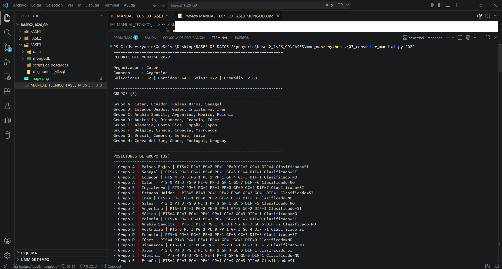
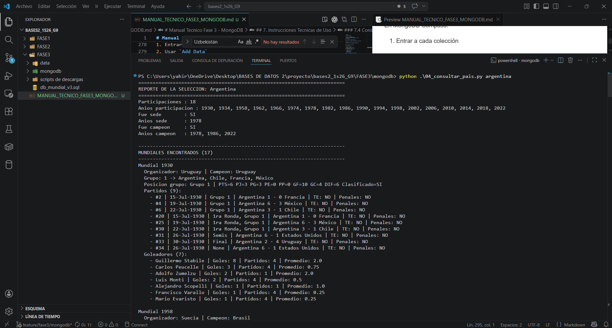
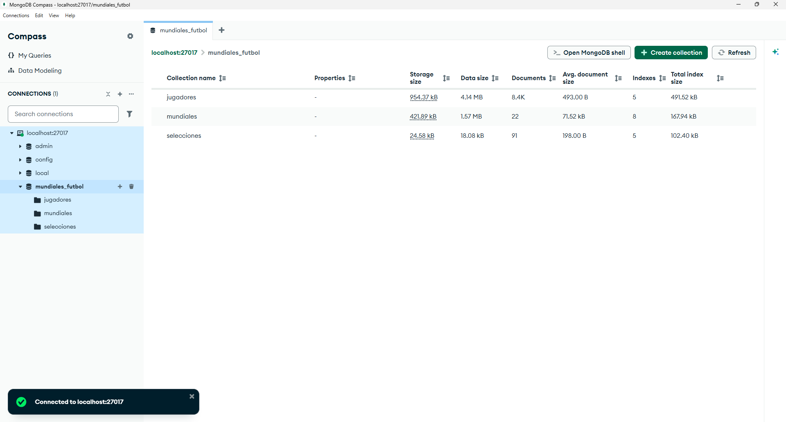
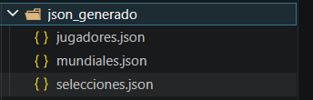
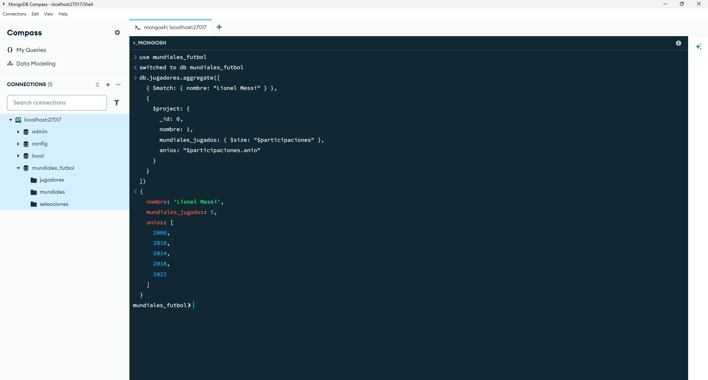

# Manual Tecnico Fase 3 - MongoDB

## 1. Introduccion

Este documento describe la solucion tecnica implementada para la **Fase 3** del proyecto, cuyo objetivo fue recavar la informacion de los mundiales de futbol a una base de datos **NoSQL en MongoDB**, a partir de los datos extraidos y normalizados previamente en las fases anteriores.

La solucion se construyo tomando como base:

- el modelo relacional definido en [FASE3/db_mundial_v3.sql](/abs/c:/Users/yahir/OneDrive/Desktop/BASES%20DE%20DATOS%202/proyecto/bases2_1s26_G9/FASE3/db_mundial_v3.sql)
- los archivos CSV consolidados ubicados en [FASE3/data/carga de datos](/abs/c:/Users/yahir/OneDrive/Desktop/BASES%20DE%20DATOS%202/proyecto/bases2_1s26_G9/FASE3/data/carga%20de%20datos)
- los scripts creados en [FASE3/mongodb](/abs/c:/Users/yahir/OneDrive/Desktop/BASES%20DE%20DATOS%202/proyecto/bases2_1s26_G9/FASE3/mongodb)

---

## 2. Objetivo Tecnico

La implementacion realizada cubre los siguientes requerimientos:

1. Crear una base de datos MongoDB para almacenar la informacion de los mundiales.
2. Definir colecciones y documentos con un modelo documental coherente con el proyecto.
3. Transformar los archivos fuente CSV en documentos compatibles con MongoDB.
4. Implementar consultas por año de mundial y por país.
5. Permitir filtros por grupo, fecha y selección.

---

## 3. Arquitectura de la Solucion

La solucion se diseñó con **3 colecciones principales**:

- `mundiales`
- `jugadores`
- `selecciones`

### 3.1 Coleccion `selecciones`

Esta coleccion funciona como catalogo maestro de selecciones nacionales.

Campos principales:

- `id_seleccion`
- `nombre`
- `participaciones`
- `sedes`
- `total_participaciones`
- `fue_campeon`
- `anios_campeon`

Uso principal:

- conocer en qué años participó una selección
- identificar si fue sede
- conocer si fue campeona y en qué años

### 3.2 Coleccion `jugadores`

Esta coleccion almacena el catalogo maestro de jugadores.

Campos principales:

- `id_jugador`
- `nombre`
- `id_seleccion`
- `seleccion`
- `altura`
- `fecha_nacimiento`
- `nacionalidad`
- `participaciones`

El campo `participaciones` es un arreglo embebido con información del jugador por mundial:

- año
- camiseta
- posición
- partidos jugados
- goles
- tarjetas
- posición final

### 3.3 Coleccion `mundiales`

Esta es la coleccion principal del sistema. Cada documento representa un mundial completo.

Campos principales:

- `anio`
- `organizador`
- `campeon`
- `num_selecciones`
- `num_partidos`
- `goles`
- `promedio_gol`

Dentro del documento también se embeben:

- `grupos`
- `posiciones_grupo`
- `posiciones_finales`
- `partidos`
- `goleadores`
- `premios`
- `equipo_ideal`
- `tarjetas`

Este enfoque permite consultar casi toda la información de un mundial leyendo un solo documento.

---

## 4. Justificacion del Modelo Documental

El diseño se basó en el script SQL de la fase 3, pero se adaptó a un enfoque documental.

Correspondencia general:

- `SELECCION` -> `selecciones`
- `JUGADOR_PAIS` + `DETALLE_JUGADOR` -> `jugadores`
- `MUNDIAL`, `GRUPO`, `POSICION_GRUPO`, `POSICION_FINAL`, `PARTIDO`, `GOL`, `GOLEADOR`, `PREMIO`, `EQUIPO_IDEAL`, `TARJETA` -> `mundiales`

La razón técnica para este diseño fue:

- reducir la cantidad de colecciones
- centralizar la consulta por año de mundial
- mantener catálogos separados para selecciones y jugadores
- facilitar el cumplimiento de los métodos requeridos por el proyecto

---

## 5. Scripts Implementados

Los scripts desarrollados se encuentran en:

- [FASE3/mongodb](/abs/c:/Users/yahir/OneDrive/Desktop/BASES%20DE%20DATOS%202/proyecto/bases2_1s26_G9/FASE3/mongodb)

### 5.1 Script de creacion de colecciones

Archivo:

- [01_crear_colecciones.js](/abs/c:/Users/yahir/OneDrive/Desktop/BASES%20DE%20DATOS%202/proyecto/bases2_1s26_G9/FASE3/mongodb/01_crear_colecciones.js)

Responsabilidad:

- crear la base `mundiales_futbol`
- crear las colecciones `selecciones`, `jugadores` y `mundiales`
- definir validadores con `$jsonSchema`
- crear índices para optimizar búsquedas y evitar duplicados

Indices implementados:

- identificadores únicos de selecciones, jugadores y mundiales
- búsqueda por nombre de selección
- búsqueda por nombre de jugador
- búsqueda por participación por año
- búsqueda por organizador y campeón
- búsqueda por país local y visitante en partidos
- búsqueda por fecha y etapa de partidos

### 5.2 Script de generacion de documentos desde CSV

Archivo:

- [02_generar_documentos_desde_csv.py](/abs/c:/Users/yahir/OneDrive/Desktop/BASES%20DE%20DATOS%202/proyecto/bases2_1s26_G9/FASE3/mongodb/02_generar_documentos_desde_csv.py)

Responsabilidad:

- leer todos los CSV consolidados
- transformar la información al modelo documental
- generar los JSON finales listos para importar
- opcionalmente insertar directo en MongoDB

Archivos JSON generados:

- [selecciones.json](/abs/c:/Users/yahir/OneDrive/Desktop/BASES%20DE%20DATOS%202/proyecto/bases2_1s26_G9/FASE3/mongodb/json_generado/selecciones.json)
- [jugadores.json](/abs/c:/Users/yahir/OneDrive/Desktop/BASES%20DE%20DATOS%202/proyecto/bases2_1s26_G9/FASE3/mongodb/json_generado/jugadores.json)
- [mundiales.json](/abs/c:/Users/yahir/OneDrive/Desktop/BASES%20DE%20DATOS%202/proyecto/bases2_1s26_G9/FASE3/mongodb/json_generado/mundiales.json)

Resultados generados en la prueba:

- 91 selecciones
- 8391 jugadores
- 22 mundiales

### 5.3 Metodo de consulta por mundial

Archivo:

- [03_consultar_mundial.py](/abs/c:/Users/yahir/OneDrive/Desktop/BASES%20DE%20DATOS%202/proyecto/bases2_1s26_G9/FASE3/mongodb/03_consultar_mundial.py)

Responsabilidad:

- recibir como parámetro principal el año del mundial
- mostrar resumen del torneo
- mostrar grupos
- mostrar posiciones de grupo
- mostrar partidos y resultados
- mostrar goleadores
- mostrar equipo ideal

Filtros implementados:

- `grupo`
- `pais`
- `fecha`

### 5.4 Metodo de consulta por pais

Archivo:

- [04_consultar_pais.py](/abs/c:/Users/yahir/OneDrive/Desktop/BASES%20DE%20DATOS%202/proyecto/bases2_1s26_G9/FASE3/mongodb/04_consultar_pais.py)

Responsabilidad:

- recibir como parámetro principal el país o selección
- mostrar años de participación
- mostrar si ha sido sede y en qué años
- mostrar si ha sido campeón y en qué años
- mostrar información de grupo
- mostrar partidos y resultados
- mostrar goleadores de la selección por mundial

Filtros implementados:

- `anio`
- `grupo`
- `fecha`

---

## 6. Flujo Tecnico de Ejecucion

El proceso implementado sigue este flujo:

1. Partir de los CSV consolidados de `FASE3/data/carga de datos`.
2. Crear la estructura de MongoDB con `01_crear_colecciones.js`.
3. Transformar los CSV a JSON con `02_generar_documentos_desde_csv.py`.
4. Importar los JSON a MongoDB o insertarlos usando `pymongo`.
5. Ejecutar consultas con `03_consultar_mundial.py` y `04_consultar_pais.py`.

Representacion resumida:

```text
CSV consolidados
    ↓
Transformacion con Python
    ↓
JSON documentales
    ↓
MongoDB
    ↓
Consultas por mundial y por pais
```

---

## 7. Instrucciones Tecnicas de Uso

### 7.1 Crear colecciones

El contenido de `01_crear_colecciones.js` puede ejecutarse en `mongosh`.

En MongoDB Compass:

1. Abrir `Open MongoDB Shell`
2. Pegar el contenido completo del script
3. Ejecutarlo

### 7.2 Generar documentos JSON

Ubicarse en la carpeta `FASE3/mongodb` y ejecutar:

```bash
python 02_generar_documentos_desde_csv.py
```

### 7.3 Importar los JSON

En MongoDB Compass:

1. Entrar a cada colección
2. Usar `Add Data`
3. Seleccionar `Import JSON`
4. Cargar los archivos:

- `selecciones.json`
- `jugadores.json`
- `mundiales.json`

### 7.4 Consulta por año de mundial

```bash
python 03_consultar_mundial.py 1930
python 03_consultar_mundial.py 1930 --pais Uruguay
python 03_consultar_mundial.py 1930 --grupo 3
python 03_consultar_mundial.py 1930 --fecha 30-Jul-1930
```


### 7.5 Consulta por país

```bash
python 04_consultar_pais.py Uruguay
python 04_consultar_pais.py Uruguay --anio 1930
python 04_consultar_pais.py Uruguay --grupo 3
python 04_consultar_pais.py Uruguay --fecha 30-Jul-1930
```

---

## 8. Consultas Directas en MongoDB Shell

Ejemplos de consultas directas en `mongosh`:

Cambiar a la base:

```javascript
use("mundiales_futbol")
```

Ver las colecciones:

```javascript
show collections
```

Consultar un mundial por año:

```javascript
db.mundiales.findOne({ anio: 1930 })
```

Consultar una selección:

```javascript
db.selecciones.findOne({ nombre: "Uruguay" })
```

Consultar jugadores de una selección:

```javascript
db.jugadores.find(
  { seleccion: "Uruguay" },
  { _id: 0, id_jugador: 1, nombre: 1, seleccion: 1 }
)
```

Consultar cuántos mundiales ganó una selección:

```javascript
db.selecciones.aggregate([
  { $match: { nombre: "Francia" } },
  {
    $project: {
      _id: 0,
      nombre: 1,
      mundiales_ganados: { $size: "$anios_campeon" }
    }
  }
])
```

Consultar cuántos mundiales jugó Messi:

```javascript
db.jugadores.aggregate([
  { $match: { nombre: "Lionel Messi" } },
  {
    $project: {
      _id: 0,
      nombre: 1,
      mundiales_jugados: { $size: "$participaciones" },
      anios: "$participaciones.anio"
    }
  }
])
```

---

## 9. Evidencias Sugeridas

Puedes agregar capturas en esta sección.

### 9.1 Creacion de colecciones en MongoDB Compass

`


### 9.3 JSON generados




### 9.6 Consultas en MongoDB Shell



---

## 10. Observaciones Tecnicas

- El modelo documental fue diseñado a partir del modelo relacional de la fase 3.
- La colección `mundiales` concentra la mayor parte de la información del torneo para facilitar consultas por año.
- Las colecciones `jugadores` y `selecciones` funcionan como catálogos de apoyo.
- Algunas filas de los datos consolidados pueden producir partidos repetidos o variaciones de etapa, lo cual proviene del dataset fuente y no del código de consulta.
- La solución implementada permite trabajar tanto desde archivos JSON como directamente desde MongoDB.

---

## 11. Conclusion Tecnica

Se implementó una solución completa para MongoDB que incluye:

- modelado documental
- creación de colecciones e índices
- transformación desde CSV
- generación de JSON
- importación a MongoDB
- métodos de consulta por año y por país

Con esto se cumple el objetivo técnico principal de la Fase 3, dejando una base NoSQL funcional, documentada y lista para ser demostrada.
